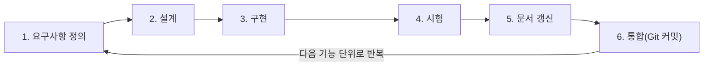

# 졸업작품 산출물 문서 (D01 ~ D04)

> 각 `###` 구역은 해당 산출물 양식의 한 칸(셀)에 그대로 복사/붙여넣기 하도록 작성했다.
> D01은 `docs/2026_졸업작품_산출물_개정/pdf/2026-개정-D01-시스템정의서.pdf`의 내용을 그대로 옮겼다.

## D01. 시스템 정의서(프로젝트 요약서)

### 팀 번호

팀 번호( - )

### 작품명(주제)

(국문) AI/MCP 통합 관계형 데이터베이스 관리 시스템 (RuSQL)

(영문) AI/MCP Integrated Relational Database Management System (RuSQL)

### 책임자

성 명 : 김규현

소 속 : 충북대학교 소프트웨어학과

학 번 : 2021041017

### 개발기간

2026년 3월 2일 ~ 2026년 12월 31일

### 참여학생

| 학번 | 이름 | 전공 |
|---|---|---|
| 2021041017 | 김규현 | 소프트웨어학과 |
| 2023041082 | Namsraijalbuu Bilguuntuguldur | 소프트웨어학과 |

### 지도교수

이종연

### 작품 설명

이 작품은 관계형 데이터베이스 엔진(SQL 처리, 저장, 트랜잭션/동시성 제어, 서버 등)을 구현하고, 이를 다루는 데스크톱 관리 도구와 AI/MCP 기술의 연동 기능을 갖춘 MySQL 프로토콜과 호환되는 관계형 데이터베이스 시스템이다.

### 사용자 유형

1. 주요 사용자 : 데이터베이스를 학습/개발하는 대학생 및 개발자
2. 보조 사용자 : 서버에 접속하는 외부 클라이언트(mysql CLI, DBeaver 등) 및 AI 어시스턴트(Claude Desktop)
3. 관리자 : 서버 운영 및 사용자/권한 관리 담당자

### 운영개념

1. RuSQL 시스템은 Windows PC에서 관계형 데이터베이스 엔진 서버와 데스크톱 관리 도구로 나뉘어 운영된다.
2. 관리 도구와 외부 클라이언트는 TCP(자체 프로토콜, MySQL 프로토콜)로 서버에 접속하여 SQL을 수행하고, AI 어시스턴트는 MCP 서버를 통해 서버와 관리 도구를 조작한다.
3. 데이터는 로컬 디스크에 저장되며, 장애 발생 시 WAL(Write-Ahead Log)로 복구한다.

### 작품의 주요 기능

1. 시중의 여러 관계형 데이터베이스 시스템들이 지원하는 주요 범위의 SQL 쿼리 처리 및 실행을 지원한다.
2. B+Tree, Hash 인덱스와 비용 기반 쿼리 최적화로 질의를 빠르게 수행한다.
3. 행 단위 MVCC, 락, 데드락 감지 등으로 여러 사용자의 동시 접속을 처리하고, 트랜잭션 4단계 격리 수준을 지원한다.
4. WAL과 Undo Log로 트랜잭션의 원자성을 보장하고, 장애 시 데이터를 복구한다.
5. MySQL 프로토콜을 지원하여 기존 MySQL 클라이언트와 호환된다.
6. 소프트웨어의 관리 도구에서 SQL 편집·실행, 스키마·ERD 조회, 서버 모니터링 등을 제공한다.
7. MCP 도구들로 AI 어시스턴트가 자연어로 데이터베이스를 조작하고 관리 도구의 화면을 조작한다.

### 기타 개발시 고려사항

1. ANSI/ISO SQL과 MySQL 프로토콜 문법을 기준으로 개발하여 기존 MySQL 클라이언트와 호환되도록 한다.
2. 모든 변경은 자동 Regression Test와 실제 서버/클라이언트를 이용한 검증을 통과해야 한다.
3. 평문 비밀번호는 전송하지 않으며, DROP 같은 위험한 SQL은 AI가 사용자 확인 없이 실행하지 못하도록 보안 장치를 마련한다.

### 선행기술 조사 분석

가. 오픈소스·상용 DBMS
1. MySQL(InnoDB) : 행 단위 MVCC, Gap Lock, 공개된 클라이언트/서버 프로토콜을 참고하여 호환 기준으로 삼았다.
2. PostgreSQL : MVCC, SSI(직렬화 스냅샷 격리), 통계 기반 옵티마이저를 참고하였다.
3. SQLite : 단일 파일 기반 임베디드 DBMS로, 서버형 다중 세션과 쓰기 동시성이 제한적이다.

나. 논문
1. C. Mohan et al., "ARIES: A Transaction Recovery Method Supporting Fine-Granularity Locking and Partial Rollbacks Using Write-Ahead Logging", ACM TODS, 1992 : WAL 기반 복구
2. M. J. Cahill et al., "Serializable Isolation for Snapshot Databases", SIGMOD, 2008 : SSI
3. P. G. Selinger et al., "Access Path Selection in a Relational Database Management System", SIGMOD, 1979 : 비용 기반 최적화
4. H. Berenson et al., "A Critique of ANSI SQL Isolation Levels", SIGMOD, 1995 : 격리 수준과 이상 현상(팬텀 등)

다. AI 연동
1. MCP(Model Context Protocol, Anthropic, 2024) : AI 어시스턴트가 외부 도구에 접속하는 개방형 표준이다. 일반적으로 공개된 MCP 데이터베이스 서버는 주로 질의/스키마 조회에 한정되나, 이 작품에서는 AI 에이전트가 행동을 할 수 있는 범위를 대폭 증강시켜 사용자와 친화적으로 구성하였고, 이에 대한 화면 조작과 위험 SQL 안전장치들까지 제공하여 보안을 강화하였다.

라. 차별점 : 기존 관계형 데이터베이스의 복잡한 시스템 및 핵심 기법을 직접 구현하여 검증하고, AI/MCP 기술을 통합하였다.

### Key Words (5개)

관계형 데이터베이스(RDBMS), MVCC, 비용 기반 쿼리 최적화, 트랜잭션, MCP

## D02. 프로젝트 관리 계획서(요약)

<!--
docs/2026_졸업작품_산출물_개정/pdf/2026-개정-D02-프로젝트관리계획서(요약).pdf의 내용을 그대로 옮겼다.
-->

### 표지

2026년 충북대학교 소프트웨어학부 졸업작품연구과제

2026년 9월 26일

문서번호 : 26-RuSQL-Doc-001

소 속 : 충북대학교 소프트웨어학과

팀 명 : RuSQL

팀 원 : 김규현, 빌궁

교 수 : 이종연 교수님

[ RuSQL ]

프로젝트 관리 계획서 (요약)

### 1. 프로젝트 개요

#### 1.1 시스템 명칭

1. 국문 : AI/MCP 통합 관계형 데이터베이스 관리 시스템 (RuSQL)
2. 영문 : AI/MCP Integrated Relational Database Management System (RuSQL)
3. RuSQL은 관계형 데이터베이스 시스템에 AI/MCP 연동 기능을 통합한 시스템이다.

#### 1.2 시스템 개요

이 작품은 관계형 데이터베이스 엔진(SQL 처리, 저장, 트랜잭션/동시성 제어, 서버 등)을 구현하고, 이를 다루는 데스크톱 관리 도구와 AI/MCP 기술의 연동 기능을 갖춘 MySQL 프로토콜과 호환되는 관계형 데이터베이스 시스템이다.

### 2. 개발 프로세스

#### 2.1 프로세스 모형

1) 선택한 모형 : 점진적 모델(Incremental Model)
2) 선택 근거
- 요구사항 변경이 자주 발생한다.
- 시스템의 기능(SQL 처리, 인덱스, 동시성 제어, 관리 도구, MCP 연동)을 독립된 단위로 나누어 순차적으로 추가할 수 있다.
- 동시성 제어와 장애 복구처럼 기술적 위험이 큰 기능은 반복마다 자동 회귀 테스트와 실제 서버 검증으로 조기에 확인한다.

#### 2.2 개발 절차

그림 1은 RuSQL의 점진적 개발 절차를 나타낸다.

그림 1. RuSQL 점진적 개발 절차

### 3. 팀 구성 : 역할 및 책임.

표 1은 팀원별 역할과 책임을 정의한다.

표 1. 팀 구성

| 이름 | 역할 | 책임 | 기타 |
|---|---|---|---|
| 김규현 | 팀장, 프로덕트 오너 | 1) 요구사항을 수집/정리하고 우선순위를 결정 2) 시스템을 설계하고 구현 3) 테스트를 수행하고 GitHub Repository, 문서를 관리 | |
| Namsraijalbuu Bilguuntuguldur | 팀원 | 1) 발표 및 AI 토큰 비용 관리 2) 산출물 문서 관리/검토 | |

### 4. 프로젝트 운영 관리

#### 4.1 팀 미팅 계획

(1) 정기 회의
- 팀 미팅 시간 : 매주 화요일 16시
- 미팅시 토의 내용 : 개인별 수행 결과 보고, 문제점 제시 및 해결 방안 토의
- 미팅 참석자 : 지도교수, 팀원, 팀장

(2) 비정기 회의
- 프로젝트 진행에 급하게 회의가 필요한 경우에 진행한다.
- Zoom, Kakaotalk, Discord 등을 활용하여 비대면으로 진행한다.

(3) 프로젝트 발표 미팅
- 설계 프로젝트 교과목의 중간 발표와 최종 발표를 준비하고 진행한다.

#### 4.2 Ground Rules

1. 개발 일정 : 팀원은 합의된 일정 안에 담당 작업을 완료한다. 일정을 지키지 못하는 팀원은 팀장에게 사전에 보고하고 일정을 재조정한다.
2. 회의 참석 : 팀원은 정기 회의에 참석한다. 불참하는 팀원은 회의 전에 팀장에게 사유를 알린다.
3. 코드 품질 : 팀원은 자동 회귀 테스트를 통과한 변경만 저장소에 반영한다.
4. 문서화 : 팀원은 기능을 변경한 반복 안에서 관련 문서를 함께 갱신한다.
5. 기여 : 팀은 새로운 아이디어를 제시하거나 기여도가 높은 팀원의 결과를 회의에서 공유하고 결과보고서에 반영한다.

### 5. 개발 환경

#### 5.1 하드웨어 개발 환경

Windows PC

#### 5.2 소프트웨어 개발 환경

표 2는 개발에 사용하는 소프트웨어의 명칭과 버전을 나타낸다.

표 2. 소프트웨어 개발 환경

| 구분 | 명칭 | 버전 | 용도 |
|---|---|---|---|
| 운영체제 | Windows 11 Pro (64비트) | 10.0.26200 | 개발 및 시험 환경 |
| 핵심 개발 언어 | C++ | C++20 | 데이터베이스 엔진, 서버, 터미널·클라이언트 도구 |
| 컴파일러 | Visual Studio 2022 (MSVC) | 17 (2022) | C++20 엔진 컴파일 |
| 빌드 도구 | CMake | 4.3.3 | 엔진 빌드 |
| 언어·도구 | Rust (Cargo) | 1.96.0 | Tauri 백엔드 |
| 런타임 | Node.js / npm | 24.16.0 / 11.13.0 | 프론트엔드 빌드 |
| 프레임워크 | Tauri | 2.11.5 (CLI 2.11.2) | 데스크톱 관리 도구 |
| 프레임워크 | React / TypeScript / Vite | 19.2.4 / 5.8.3 / 7.3.5 | 관리 도구 화면 |
| 라이브러리 | Monaco Editor (@monaco-editor/react) | 4.7.0 | SQL 편집기 |
| 언어 | Python | 3.14.4 | MCP 서버, 벤치마크 스크립트 |
| 오픈소스 라이브러리 | nlohmann/json, LZ4, Catch2, SHA-1, PicoSHA2 | 3.11.3, 1.9.4, 2.13.10, -, - | JSON 처리, 압축, 단위 테스트, 인증 해시 |
| 비교·검증 | MySQL Server / Client | 8.4 | 호환성 및 성능 비교 검증 |
| 형상 관리 | Git / GitHub | - | 소스 코드 및 문서 관리 |
| 편집기 | Visual Studio Code | - | 코드 및 문서 편집 |
| AI 도구 | Claude Desktop | - | MCP 연동 시험 |

#### 5.3 문서 작성 도구

1. 산출물 문서(D01 ~ D08) : 한글/PDF
2. 다이어그램 : draw.io, mermaid.ai

### 6. 산출물 목록

표 3은 산출물의 문서코드, 문서명, 작성 담당자, 완료 예정일을 정의한다.

표 3. 산출물 목록

| 순서 | 문서코드 | 문서명 | 작성 담당자 | 완료 예정일 |
|---|---|---|---|---|
| 1 | RuSQL_D01_v1.0 | 시스템 정의서(프로젝트 요약서) | 김규현, 빌궁 | - |
| 2 | RuSQL_D02_v1.0 | 프로젝트 관리 계획서(요약) | 김규현, 빌궁 | - |
| 3 | RuSQL_D03_v1.0 | 소프트웨어 기능 아키텍처 | 김규현, 빌궁 | - |
| 4 | RuSQL_D04_v1.0 | 프로덕트 백로그(요구사항 정의) | 김규현, 빌궁 | - |
| 5 | RuSQL_D05_v1.0 | N차 스프린트 백로그(태스크 목록) | 김규현, 빌궁 | - |
| 6 | RuSQL_D06_v1.0 | N차 스프린트 명세서 | 김규현, 빌궁 | - |
| 7 | RuSQL_D07_v1.0 | 소프트웨어 시스템 시험 결과서 | 김규현, 빌궁 | - |
| 8 | RuSQL_D08_v1.0 | 프로젝트 결과보고서 | 김규현, 빌궁 | - |

### 7. 기타 사항

형상 관리 : 팀은 소스 코드와 문서를 Git으로 관리하고 GitHub 저장소(https://github.com/rspstat/RuSQL)에 반영한다.

이전 구현 : 초기에 Rust로 구현하였던 버전은 저장소의 legacy 브랜치에 보존하며, 현재 C++로 포팅된 최신 버전은 main 브랜치에서 진행한다.

### 8. 참고문헌 및 부록

해당 없음.

<끝>

## D03. 소프트웨어 기능 아키텍처

(작성 예정)

## D04. 프로덕트 백로그(요구사항 정의)

(작성 예정)
