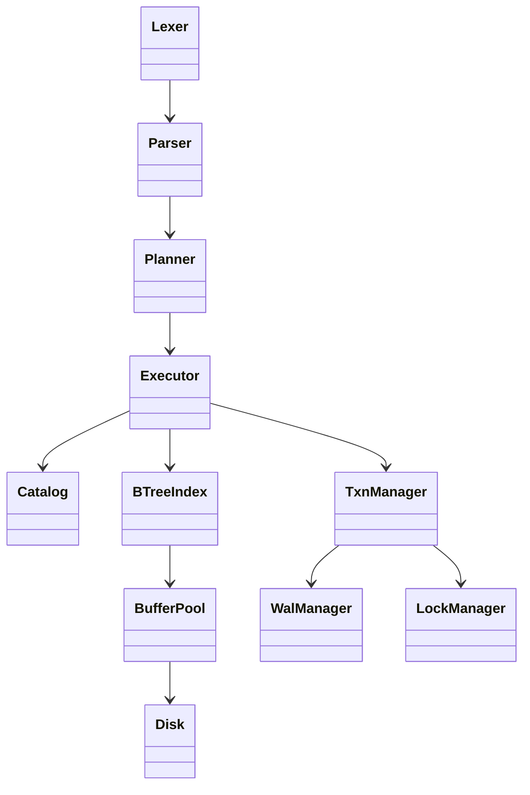
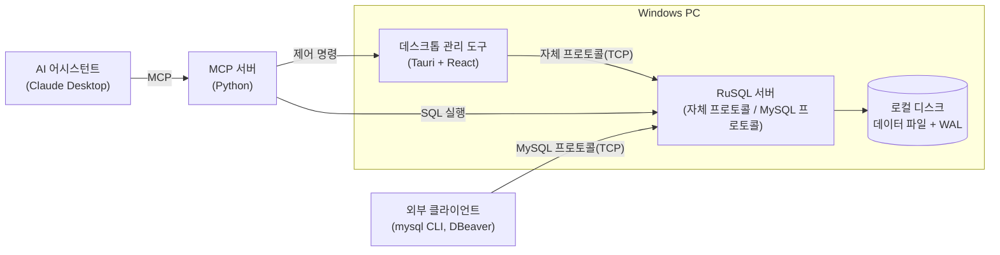
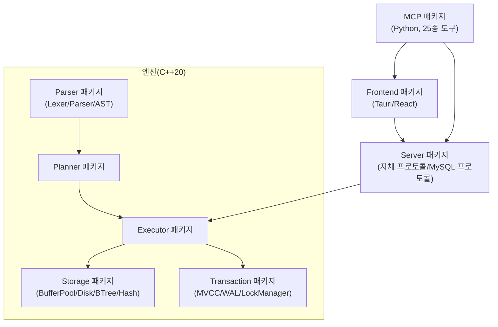

# 졸업작품 산출물 문서 (D05 ~ D08)

> 각 `###` 구역은 해당 산출물 양식의 한 칸(셀)에 그대로 복사/붙여넣기 하도록 작성한다.
> D05~D08은 각 pdf 양식(`docs/2026_졸업작품_산출물_개정/pdf/2026-개정-D05~D08-*.pdf`)의 가이드라인·목차를 그대로 따랐다.
> 본 프로젝트는 스프린트를 나누지 않고 하나의 반복(점진적 모델, D02 참고)으로 진행했으므로, D05·D06의 "N차 스프린트"는 **1차(전체 프로젝트)** 로 통일해 작성했다. (2026-09-28 사용자 결정)

## D05. N차 스프린트 백로그(태스크 목록)

<!--
docs/2026_졸업작품_산출물_개정/pdf/2026-개정-D05-N차_스프린트백로그(태스크목록).pdf 양식에 맞춰 작성했다.
-->

### 1. 프로젝트 개요

#### 1.1 시스템명

1. 국문 : AI/MCP 통합 관계형 데이터베이스 관리 시스템 (RuSQL)
2. 영문 : AI/MCP Integrated Relational Database Management System (RuSQL)

#### 1.2 시스템 개요

이 작품은 관계형 데이터베이스 엔진(SQL 처리, 저장, 트랜잭션/동시성 제어, 서버 등)을 구현하고, 이를 다루는 데스크톱 관리 도구와 AI/MCP 기술의 연동 기능을 갖춘 MySQL 프로토콜과 호환되는 관계형 데이터베이스 시스템이다.

### 2. 1차 스프린트 - 요구사항

#### 3.1 1차 스프린트 개발기간 : From ( 2026-03-02 ) To ( 2026-12-31 )

#### 3.2 요구사항 목록

본 프로젝트는 하나의 스프린트로 전체 개발을 진행하므로, 1차 스프린트의 범위는 D04 프로덕트 백로그의 사용자 스토리 전체(표 4, US-01 ~ US-15)와 같다. D04의 표 4를 그대로 인용한다.

| 에픽ID | 에픽명 | US_ID | 사용자 스토리 | 추정작업량 | 우선순위 | 참고 |
|---|---|---|---|---|---|---|
| E-01 | SQL 파싱·실행 | US-01 | 사용자는 SELECT/INSERT/UPDATE/DELETE 등 SQL 문을 실행하기 위하여 SQL 문을 서버에 전달한다. | 8 | 상 | |
| | | US-02 | 사용자는 여러 테이블을 조합한 결과를 얻기 위하여 JOIN·서브쿼리·CTE가 포함된 SQL 문을 실행한다. | 8 | 상 | |
| E-02 | 비용 기반 질의 최적화 | US-03 | 사용자는 대량 데이터에서 빠른 응답을 얻기 위하여 B+Tree·Hash 인덱스를 생성한다. | 5 | 상 | |
| | | US-04 | 사용자는 실행 계획을 확인하기 위하여 EXPLAIN으로 질의 계획을 조회한다. | 3 | 중 | |
| E-03 | MVCC 트랜잭션 처리 | US-05 | 사용자는 여러 세션에서 안전하게 데이터를 갱신하기 위하여 BEGIN/COMMIT/ROLLBACK으로 트랜잭션을 실행한다. | 8 | 상 | |
| | | US-06 | 사용자는 트랜잭션의 데이터 정합성 수준을 선택하기 위하여 4단계 격리 수준 중 하나를 지정한다. | 5 | 중 | |
| E-04 | 락·데드락 감지 | US-07 | 사용자는 동시 갱신 충돌 시 시스템이 정지하지 않도록 데드락이 자동으로 감지·해소되기를 기대한다. | 5 | 중 | |
| E-05 | WAL·Undo 복구 | US-08 | 관리자는 서버 비정상 종료 후에도 데이터를 보존하기 위하여 재기동 시 자동 복구가 수행되기를 기대한다. | 8 | 상 | |
| E-06 | MySQL 와이어 프로토콜 서버 | US-09 | 외부 클라이언트 사용자는 기존 도구를 그대로 쓰기 위하여 mysql CLI·DBeaver로 서버에 접속한다. | 5 | 상 | |
| E-07 | SQL 편집기 | US-10 | 사용자는 SQL을 편리하게 작성하기 위하여 관리 도구의 편집기에서 SQL을 작성·실행한다. | 5 | 상 | |
| E-08 | 스키마·ERD 뷰어 | US-11 | 사용자는 테이블 구조를 파악하기 위하여 스키마와 ERD를 조회한다. | 3 | 중 | |
| E-09 | 서버 모니터링 | US-12 | 관리자는 서버 상태를 확인하기 위하여 연결 목록과 서버 상태를 조회한다. | 2 | 중 | |
| E-10 | MCP로 DB 제어 | US-13 | AI 어시스턴트는 사용자를 대신해 SQL을 실행하기 위하여 MCP execute_sql 도구를 호출한다. | 5 | 상 | |
| E-11 | MCP로 관리 도구 제어 | US-14 | AI 어시스턴트는 사용자의 작업을 돕기 위하여 MCP 도구로 편집기 탭을 생성·전환하고 SQL을 기입한다. | 5 | 중 | |
| E-12 | 위험 SQL 안전장치 | US-15 | 사용자는 실수로 데이터를 잃지 않기 위하여 AI가 DROP 등 위험 SQL 실행 전에 확인을 요청하기를 기대한다. | 3 | 상 | |

### 3. 1차 스프린트 - 태스크

#### 3.1 태스크 목록

표 1은 2절 요구사항을 구현하기 위한 태스크 목록이다.

표 1. 태스크 목록

| US_ID | 스토리(요약) | TK_ID | 테스크 명 | 담당자 | 종료일 | 비고 |
|---|---|---|---|---|---|---|
| US-01, US-02 | SQL 실행 | TK-01 | 렉서·파서·AST 구현 | 김규현 | 04/30 | |
| US-03, US-04 | 인덱스·최적화 | TK-02 | B+Tree·Hash 인덱스, 비용 기반 플래너 구현 | 김규현 | 06/15 | |
| US-05, US-06 | 트랜잭션 | TK-03 | MVCC·트랜잭션 매니저, 격리 수준 구현 | 김규현 | 07/15 | |
| US-07 | 락·데드락 | TK-04 | 락 매니저·데드락 감지 구현 | 김규현 | 07/31 | |
| US-08 | 장애 복구 | TK-05 | WAL·Undo Log 및 복구 로직 구현 | 김규현 | 08/15 | |
| US-09 | MySQL 프로토콜 | TK-06 | MySQL 와이어 프로토콜 서버 구현 | 김규현 | 08/31 | |
| US-10, US-11, US-12 | 관리 도구 | TK-07 | Tauri·React 데스크톱 관리 도구(편집기·ERD·모니터링) 구현 | 김규현 | 09/15 | |
| US-13, US-14, US-15 | MCP 연동 | TK-08 | MCP 서버 25종 도구 및 위험 SQL 확인 절차 구현 | 김규현 | 09/26 | |
| US-01 ~ US-15 | 전체 | TK-09 | 자동 회귀 테스트(Catch2) 작성 및 실행 | 김규현 | 09/26 | 392개 테스트 케이스, 22,635개 검증문 |
| US-01 ~ US-15 | 전체 | TK-10 | 산출물 문서(D01~D08) 작성 | 김규현, 빌궁 | 진행중 | |
| US-01 ~ US-15 | 전체 | TK-11 | 중간·최종 발표 준비 | 김규현, 빌궁 | 진행중 | |
| US-01 ~ US-15 | 전체 | TK-12 | AI 토큰 비용 관리 | 빌궁 | 상시 | |

### 4. 소요 기술

표 2와 같이 개발에 필요한 도구·환경을 정리한다.

표 2. 소요 기술

| 번호 | 도구 / 환경 | 담당자 | 완료일 | 비고 |
|---|---|---|---|---|
| 1 | C++20, CMake, Visual Studio 2022(MSVC) 빌드 환경 | 김규현 | 03/15 | 엔진·서버 빌드 |
| 2 | Rust(Cargo), Tauri, React/TypeScript/Vite 프론트엔드 환경 | 김규현 | 04/01 | 데스크톱 관리 도구 |
| 3 | Python, FastMCP 기반 MCP 서버 환경 | 김규현 | 08/15 | AI 연동 |
| 4 | Catch2 단위·통합 테스트 프레임워크 | 김규현 | 03/20 | 자동 회귀 테스트 |
| 5 | Git/GitHub 저장소 및 브랜치 전략(legacy/main) | 김규현 | 03/02 | 소스·문서 관리 |
| 6 | MySQL Server/Client 8.4 (호환성 비교 검증용) | 김규현 | 08/20 | 프로토콜 호환성 검증 |

### 5. 기타 사항

본 산출물에 명시되지 않은 사항은 상위 문서인 프로젝트 관리 계획서(D02)를 따른다.

<끝>

## D06. N차 스프린트 명세서

<!--
docs/2026_졸업작품_산출물_개정/pdf/2026-개정-D06-N차_스프린트명세서.pdf 양식에 맞춰 작성했다.
목차의 "3. 사용자 인터페이스"는 원본 pdf 목차의 번호 오기이며, 본문에서는 4절로 기술되어 있어 본문 번호(1~5)를 그대로 따랐다.
-->

### 1. 프로젝트 개요

#### 1.1 시스템명

1. 국문 : AI/MCP 통합 관계형 데이터베이스 관리 시스템 (RuSQL)
2. 영문 : AI/MCP Integrated Relational Database Management System (RuSQL)

#### 1.2 시스템 개요

이 작품은 관계형 데이터베이스 엔진(SQL 처리, 저장, 트랜잭션/동시성 제어, 서버 등)을 구현하고, 이를 다루는 데스크톱 관리 도구와 AI/MCP 기술의 연동 기능을 갖춘 MySQL 프로토콜과 호환되는 관계형 데이터베이스 시스템이다.

### 2. 태스크 목록

D05의 표 1 태스크 목록에 완료율을 더하여 표 3과 같이 나타낸다.

표 3. 태스크 목록 및 완료율

| US_ID | 스토리(요약) | TK_ID | 테스크 명 | 담당자 | 종료일 | 완료% |
|---|---|---|---|---|---|---|
| US-01, US-02 | SQL 실행 | TK-01 | 렉서·파서·AST 구현 | 김규현 | 04/30 | 100 |
| US-03, US-04 | 인덱스·최적화 | TK-02 | B+Tree·Hash 인덱스, 비용 기반 플래너 구현 | 김규현 | 06/15 | 100 |
| US-05, US-06 | 트랜잭션 | TK-03 | MVCC·트랜잭션 매니저, 격리 수준 구현 | 김규현 | 07/15 | 100 |
| US-07 | 락·데드락 | TK-04 | 락 매니저·데드락 감지 구현 | 김규현 | 07/31 | 100 |
| US-08 | 장애 복구 | TK-05 | WAL·Undo Log 및 복구 로직 구현 | 김규현 | 08/15 | 100 |
| US-09 | MySQL 프로토콜 | TK-06 | MySQL 와이어 프로토콜 서버 구현 | 김규현 | 08/31 | 100 |
| US-10, US-11, US-12 | 관리 도구 | TK-07 | Tauri·React 데스크톱 관리 도구 구현 | 김규현 | 09/15 | 100 |
| US-13, US-14, US-15 | MCP 연동 | TK-08 | MCP 서버 25종 도구 및 위험 SQL 확인 절차 구현 | 김규현 | 09/26 | 100 |
| US-01 ~ US-15 | 전체 | TK-09 | 자동 회귀 테스트(Catch2) 작성 및 실행 | 김규현 | 09/26 | 100 |
| US-01 ~ US-15 | 전체 | TK-10 | 산출물 문서(D01~D08) 작성 | 김규현, 빌궁 | (진행중) | 50 |
| US-01 ~ US-15 | 전체 | TK-11 | 중간·최종 발표 준비 | 김규현, 빌궁 | (진행중) | ※ 사용자 확인 필요 |
| US-01 ~ US-15 | 전체 | TK-12 | AI 토큰 비용 관리 | 빌궁 | 상시 | ※ 사용자 확인 필요 |

> TK-11·TK-12의 완료%는 실제 진행 상황을 제가 확인할 수 없어 채우지 못했습니다. 실제 값으로 수정해 주세요.

### 3. 기술 명세

#### 3.1 클래스 명세

본 프로젝트는 하나의 스프린트로 전체 개발을 포함하므로, 엔진의 전체 클래스 대신 계층별 핵심 클래스만 대표로 명세한다(단순화 사항). 그림 2는 핵심 클래스 간의 관계를 나타낸다.

그림 2. RuSQL 엔진 핵심 클래스 다이어그램

[1] 클래스 : Catalog

| 분류 | 멤버 변수/함수 | 설명 | 타입 | 참고 |
|---|---|---|---|---|
| 멤버 변수 | tables | 테이블명→TableSchema(컬럼·PK·CHECK 제약·파티션 정보) 맵 | Public | |
| 멤버 함수 | create_table(name, columns) | 테이블을 생성한다. | Public | |
| | drop_table(name) | 테이블을 삭제한다. | Public | |
| | get_table(name) | 테이블 스키마를 조회한다. | Public | |

[2] 클래스 : TxnManager

| 분류 | 멤버 변수/함수 | 설명 | 타입 | 참고 |
|---|---|---|---|---|
| 멤버 함수 | begin() | 새 트랜잭션을 시작하고 스냅샷을 부여한다. | Public | |
| | commit(txn_id) | 변경을 WAL에 기록하고 트랜잭션을 확정한다. | Public | |
| | rollback(txn_id) | Undo Log로 변경을 되돌린다. | Public | |
| | is_visible(row, txn_id) | 행이 해당 트랜잭션에 보이는지 MVCC 규칙으로 판정한다. | Public | |

[3] 클래스 : LockManager

| 분류 | 멤버 변수/함수 | 설명 | 타입 | 참고 |
|---|---|---|---|---|
| 멤버 함수 | lock(txn_id, resource, mode) | 자원에 공유/배타 락을 건다. | Public | |
| | detect_deadlock() | 대기 그래프를 순회해 데드락을 감지한다. | Public | Gap Lock 포함 |
| | unlock_all(txn_id) | 트랜잭션 종료 시 보유 락을 모두 해제한다. | Public | |

#### 3.2 핵심 알고리즘 명세

[1] 메소드 : select_plan( ) @ Planner

1. 질의에 사용된 테이블·조건에서 후보 인덱스(B+Tree/Hash)를 수집한다.
2. 테이블 통계(TableStats)를 이용해 각 후보의 예상 비용을 계산한다.
3. 비용이 가장 낮은 접근 경로(전체 스캔 또는 인덱스 스캔)를 실행 계획으로 선택한다.
4. 조인이 있는 경우 조인 순서·방식(Nested Loop/Hash Join)도 같은 방식으로 비교하여 선택한다.

[2] 메소드 : recover( ) @ TxnManager

1. 서버 기동 시 WAL을 처음부터 순차적으로 읽는다.
2. 커밋 레코드가 있는 트랜잭션의 변경은 REDO로 재적용한다.
3. 커밋 레코드가 없는 트랜잭션의 변경은 Undo Log로 롤백한다.
4. 복구가 끝나면 정상 커밋된 상태로 서버를 기동한다.

#### 3.3 DB 스키마 명세

RuSQL은 그 자체가 데이터베이스 엔진이므로, 별도의 응용 프로그램용 DB는 없다. 대신 엔진이 내부적으로 유지하는 시스템 카탈로그(메타데이터) 구조를 표 4와 같이 명세한다.

표 4. 시스템 카탈로그(TableSchema) 명세

| Attributes | Types | Stored procedure (if any) |
|---|---|---|
| name | string | |
| columns | ColumnDef 목록(이름, 타입, NULL 허용, 기본값 등) | |
| primary_key_columns | string 목록 | |
| check_constraints | CheckConstraint 목록 | |
| partition_info | PartitionBy(선택) | |
| auto_increment_counters | 컬럼명→정수 맵 | |

#### 3.4 API 명세

현재 스프린트에서 개발된 MCP 서버는 AI 어시스턴트가 사용하는 외부 인터페이스이다. 전체 25종 중 대표 항목을 표 5에 명세하며, 전체 목록은 `code/mcp/mcp_server.py`를 참고한다.

표 5. API(MCP 도구) 명세

| 인터페이스명 | 대상 | 설명 |
|---|---|---|
| execute_sql(sql, database) | RuSQL 서버 | SQL을 실행하고 결과를 반환한다. |
| confirm_dangerous_sql(sql, database) | RuSQL 서버 | DROP 등 위험 SQL 실행 전 사용자 확인을 받는다. |
| list_databases( ) / list_tables(database) | RuSQL 서버 | 데이터베이스·테이블 목록을 조회한다. |
| get_table_schema(table, database) | RuSQL 서버 | 테이블 스키마를 조회한다. |
| explain_query(sql, database) | RuSQL 서버 | 실행 계획을 조회한다. |
| write_to_editor(query, tab) | 관리 도구 | 관리 도구 편집기 탭에 SQL을 기입한다. |
| start_server(port) / stop_server( ) / get_server_status( ) | RuSQL 서버 | 서버를 기동·정지하고 상태를 조회한다. |

### 4. 사용자 인터페이스(GUI)

관리 도구는 다음 화면으로 구성된다.

1. SQL 편집기 화면 — Monaco Editor 기반 SQL 작성·실행, 결과 그리드 표시. (SQL 편집기 실행 화면 스크린샷)
2. 스키마·ERD 뷰어 화면 — 테이블·컬럼·외래키 관계를 ERD로 표시. (ERD 뷰어 화면 스크린샷)
3. 연결 관리자 화면 — 서버 연결 정보(호스트·포트·계정)를 추가·수정·삭제. (연결 관리자 화면 스크린샷)
4. 서버 모니터링 화면 — 서버 기동 상태와 연결된 세션을 표시. (서버 모니터링 화면 스크린샷)

### 5. 기타 참고 사항

1. 오픈소스 사용 정보 : nlohmann/json(MIT), LZ4(BSD-2-Clause), Catch2(BSL-1.0), PicoSHA2(MIT), SHA-1(퍼블릭 도메인 참고 구현)을 C++ 엔진에서 사용했다. 데스크톱 도구는 Tauri(MIT/Apache-2.0), React(MIT)를 사용했다.
2. 이전 구현 : 초기 Rust 구현은 저장소의 legacy 브랜치에 보존하고 있으며, C++로 포팅한 버전을 main 브랜치에서 계속 개발했다.
3. 다음 반복 시 고려 사항 : XA 분산 트랜잭션, 페이지 단위 버퍼 풀 교체 알고리즘, WAL 기반 복제(replication)는 2026-09-21 결정에 따라 본 프로젝트의 개발 범위에서 제외했다. 남은 기간에는 신규 기능 대신 성능 벤치마크와 안정성 보강을 진행한다.

<끝>

## D07. 소프트웨어 시스템 시험 결과서

<!--
docs/2026_졸업작품_산출물_개정/pdf/2026-개정-D07-소프트웨어시스템시험결과서.pdf 양식에 맞춰 작성했다.
2.2절·6절의 자동 회귀 테스트 수치는 engine_tests.exe(Catch2)를 2026-09-28에 직접 실행해 확인한 값이다.
-->

### 1. 프로젝트 개요

#### 1.1 시스템 명

1. 국문 : AI/MCP 통합 관계형 데이터베이스 관리 시스템 (RuSQL)
2. 영문 : AI/MCP Integrated Relational Database Management System (RuSQL)

#### 1.2 시스템 개요

이 작품은 관계형 데이터베이스 엔진(SQL 처리, 저장, 트랜잭션/동시성 제어, 서버 등)을 구현하고, 이를 다루는 데스크톱 관리 도구와 AI/MCP 기술의 연동 기능을 갖춘 MySQL 프로토콜과 호환되는 관계형 데이터베이스 시스템이다.

### 2. 테스트 개요

#### 2.1 테스트 범위

1. 본 시스템 테스트는 D04 프로덕트 백로그에 명세된 전체 주제(T-01 ~ T-06, 에픽 12개)를 대상으로 한다.
2. T-01(SQL 처리) ~ T-04(MySQL 프로토콜 호환)는 자동 회귀 테스트(Catch2)로 상시 검증하며, T-05(관리 도구)·T-06(MCP·AI 연동)은 GUI·AI 도구가 대상이라 자동화 테스트 범위 밖이므로 수동 시나리오 테스트로 검증한다.
3. 2026-09-21 결정에 따라 XA 분산 트랜잭션, 페이지 단위 버퍼 풀 교체 알고리즘, WAL 기반 복제(replication)는 개발 범위 자체에서 제외했으므로 테스트 대상에서도 제외한다.

#### 2.2 테스트 항목 및 통과 기준

표 1은 테스트 항목별 척도와 통과 기준을 나타낸다.

표 1. 테스트 항목 및 통과 기준

| 테스트 항목 | 척도 | 통과기준 |
|---|---|---|
| T-01 SQL 처리 | 기능구현범위 X = A/B (A: 구현확인된 기능 수, B: 명세된 기능 수) | 1.0 |
| | 실행된 테스트 케이스 수 = X개, 실패한 테스트 케이스 수 = Y개, 테스트 종료 조건 = Y/X | 0.0 |
| T-02 트랜잭션·동시성 | 위와 동일 | 1.0 / 0.0 |
| T-03 장애 복구 | 위와 동일 | 1.0 / 0.0 |
| T-04 MySQL 프로토콜 호환 | 위와 동일 | 1.0 / 0.0 |
| T-05 관리 도구 | 수동 시나리오 테스트로 기능구현범위·통과 여부 확인 | 1.0 / 0.0 |
| T-06 MCP·AI 연동 | 수동 시나리오 테스트로 기능구현범위·통과 여부 확인 | 1.0 / 0.0 |

### 3. 테스트 케이스

표 2는 대표 테스트 케이스 예시이다(테스트 데이터가 방대하여 항목별 대표 사례만 기술).

표 2. 대표 테스트 케이스

| Test ID | 테스트 항목 | 입력 데이터/시나리오 | 출력 데이터 |
|---|---|---|---|
| STC-T01-001 | JOIN 조회 | `SELECT ... FROM a JOIN b ON ...` 실행 | 조인된 결과 집합 반환 |
| STC-T01-002 | 인덱스 스캔 | 인덱스 컬럼에 대한 WHERE 조건으로 조회 | 인덱스를 사용한 실행 계획으로 결과 반환 |
| STC-T02-001 | 트랜잭션 격리 | 두 세션이 동시에 같은 행을 UPDATE | 한 세션은 대기 후 정상 커밋, 데이터 정합성 유지 |
| STC-T02-002 | 데드락 감지 | 두 트랜잭션이 상호 락 대기 상태에 진입 | 데드락 감지 후 한 트랜잭션이 오류로 롤백됨 |
| STC-T03-001 | 장애 복구 | WAL이 남은 상태에서 서버 프로세스를 강제 종료 후 재기동 | 커밋된 변경은 유지, 미커밋 변경은 롤백됨 |
| STC-T04-001 | MySQL 클라이언트 접속 | `mysql -h 127.0.0.1 -P <port> -u root` 접속 후 SHOW TABLES | 테이블 목록이 정상 출력됨 |
| STC-T06-001 | MCP SQL 실행 | AI가 execute_sql로 SELECT 문 실행 요청 | 결과 텍스트가 AI에게 반환됨 |
| STC-T06-002 | 위험 SQL 확인 | AI가 DROP TABLE 요청 | confirm_dangerous_sql 확인 절차 없이는 실행되지 않음 |

### 4. 테스트 예외사항

#### 4.1 중단 기준과 재개 조건

표 3과 같이 테스트 중단·재개 기준을 정의한다.

표 3. 중단 기준과 재개 조건

| 중단 기준 | 재개 조건 |
|---|---|
| 서버 프로세스가 비정상 종료(크래시)하여 이후 테스트를 진행할 수 없는 경우 | 로그로 원인을 확인해 결함을 수정한 뒤 서버를 재기동하고, 중단된 테스트 케이스부터 재개한다. |
| 테스트 중 데이터 파일이 손상되어 이후 결과 검증이 무의미해지는 경우 | 테스트용 데이터 디렉터리를 초기화하고 처음부터 재수행한다. |
| 자동 회귀 테스트(Catch2)가 실패하는 경우 | 실패한 테스트 케이스를 먼저 수정하고 전체 스위트가 통과함을 확인한 뒤 시스템 테스트를 재개한다. |

### 5. 테스트 환경

#### 5.1 HW 테스트 환경 구성

본 프로젝트는 별도의 서버·클라이언트 장비를 구성하지 않고, 하나의 Windows PC에서 서버와 클라이언트를 함께 실행하여 테스트한다.

표 4. HW 테스트 환경

| 역할 | 제품내역 | 수량 |
|---|---|---|
| 서버 + 클라이언트 | Windows PC | 1 |

#### 5.2 SW 테스트 환경 구성

표 5. SW 테스트 환경

| 구분 | 구성요소 | 제품내역 |
|---|---|---|
| 서버 공통 | O/S | Windows 11 Pro (64비트), 10.0.26200 |
| | 네트워크 | TCP/IP |
| DB 서버 | DBMS | RuSQL (자체 구현) |
| | 테스트 프레임워크 | Catch2 2.13.10 |
| 비교·검증 | MySQL Server/Client | 8.4 |
| 클라이언트 | 접속 도구 | mysql CLI, DBeaver |
| AI 도구 | MCP 클라이언트 | Claude Desktop |

### 6. 테스트 결과

1. 자동 회귀 테스트(Catch2)는 T-01 ~ T-04에 대해 총 392개 테스트 케이스, 22,635개 검증문(assertion)을 2026-09-28에 실행하여 전량 통과했다(실패 0건).
2. 표 6은 주제별 자동 테스트 실행 결과이다.

표 6. 주제별 자동 회귀 테스트 결과

| 주제 | 실행된 테스트 케이스 수(X) | 실패한 테스트 케이스 수(Y) | 테스트 종료 조건(Y/X) |
|---|---|---|---|
| T-01 SQL 처리 | 282 | 0 | 0.0 |
| T-02 트랜잭션·동시성 | 95 | 0 | 0.0 |
| T-03 장애 복구 | 8 | 0 | 0.0 |
| T-04 MySQL 프로토콜 호환 | 3 | 0 | 0.0 |

> ※ T-05(관리 도구)·T-06(MCP·AI 연동)의 수동 시나리오 테스트 결과(표 7)는 제가 직접 실행해 확인할 수 없어 비워두었습니다. 실제 수행 후 Y/N과 결과를 채워 주세요.

표 7. 수동 시나리오 테스트 결과 (사용자 작성용)

| ID | 테스트 설명 | 입력 값/시나리오 | 예상결과 | 수행여부 | 수행결과 |
|---|---|---|---|---|---|
| STC-T05-001 | SQL 편집기 실행 | 편집기에서 SELECT 문 작성 후 실행 | 결과 그리드에 데이터 표시 | | |
| STC-T06-001 | MCP SQL 실행 | AI가 execute_sql 호출 | 결과 텍스트 반환 | | |
| STC-T06-002 | 위험 SQL 확인 | AI가 DROP TABLE 요청 | 확인 절차 없이 미실행 | | |

### 7. 부록

해당 없음.

<끝>

## D08. 프로젝트 결과보고서

<!--
docs/2026_졸업작품_산출물_개정/pdf/2026-개정-D08-프로젝트 결과보고서.pdf 양식에 맞춰 작성했다. 전체 분량 2쪽 제한에 맞춰 표지 표는 간결하게 작성하고, 세부 아키텍처는 부록에 담았다.
-->

### 팀 번호

팀 번호( - )

### 프로젝트명(주제)

(국문) AI/MCP 통합 관계형 데이터베이스 관리 시스템 (RuSQL)

(영문) AI/MCP Integrated Relational Database Management System (RuSQL)

### 팀장

학부(과) : 소프트웨어학과

학번 : 2021041017

성 명 : 김규현

역할 : 팀장, 프로덕트 오너

### 개발기간

2026년 3월 2일 ～ 2026년 12월 31일

### GitHub저장소

https://github.com/rspstat/RuSQL

### 참여학생

| 학부(과) | 학년/학번 | 성명 | 역할 |
|---|---|---|---|
| 소프트웨어학과 | 4학년/2021041017 | 김규현 | 팀장, 시스템 설계·구현, 문서·저장소 관리 |
| 소프트웨어학과 | -/2023041082 | Namsraijalbuu Bilguuntuguldur | 발표, AI 토큰 비용 관리, 산출물 문서 관리·검토 |

### 지도교수

이종연

### 프로젝트(주제) 수행 계획에 대한 요약

#### 시스템 설명

관계형 데이터베이스 엔진(SQL 처리, 저장, 트랜잭션/동시성 제어, 서버)을 구현하고, 이를 다루는 데스크톱 관리 도구와 AI/MCP 연동 기능을 갖춘 MySQL 프로토콜 호환 관계형 데이터베이스 시스템이다.

#### 시스템 운영 환경

Windows PC에서 RuSQL 서버와 데스크톱 관리 도구를 함께 운영한다. 외부 클라이언트(mysql CLI, DBeaver)는 MySQL 프로토콜로, AI 어시스턴트(Claude Desktop)는 MCP 서버를 통해 접속한다.

#### 개발 적용 기술

C++20(MSVC, CMake) 엔진·서버, Rust/Tauri + React/TypeScript/Vite 데스크톱 관리 도구, Python(MCP) AI 연동, Catch2 자동 회귀 테스트. 핵심 기법으로 B+Tree/Hash 인덱스, 비용 기반 쿼리 최적화, 행 단위 MVCC, WAL/Undo Log, MySQL 와이어 프로토콜을 구현했다.

### 개발목표결과물

(RuSQL 시스템 구성도 그림)

(관리 도구 실행 화면 캡처: SQL 편집기, ERD 뷰어)

### 프로젝트 산출물 목록

| 순서 | 문서코드 | 문서명 | 작성 담당자 |
|---|---|---|---|
| 1 | RuSQL_D01_v1.0 | 시스템 정의서(프로젝트 요약서) | 김규현, 빌궁 |
| 2 | RuSQL_D02_v1.0 | 프로젝트 관리 계획서(요약) | 김규현, 빌궁 |
| 3 | RuSQL_D03_v1.0 | 소프트웨어 기능 아키텍처 | 김규현, 빌궁 |
| 4 | RuSQL_D04_v1.0 | 프로덕트 백로그(요구사항 정의) | 김규현, 빌궁 |
| 5 | RuSQL_D05_v1.0 | N차 스프린트 백로그(태스크 목록) | 김규현, 빌궁 |
| 6 | RuSQL_D06_v1.0 | N차 스프린트 명세서 | 김규현, 빌궁 |
| 7 | RuSQL_D07_v1.0 | 소프트웨어 시스템 시험 결과서 | 김규현, 빌궁 |
| 8 | RuSQL_D08_v1.0 | 프로젝트 결과보고서 | 김규현, 빌궁 |
| 9 | RuSQL_SRC_v1.0 | 소스 코드 및 개발 문서 | 김규현, 빌궁 |

### 시스템 활용 효과

1. 관계형 데이터베이스의 핵심 기법(MVCC, WAL, 비용 기반 최적화)을 직접 구현·검증하여 동작 원리에 대한 이해를 높였다.
2. MCP 기반 AI-DB 연동으로 자연어 요청을 통한 데이터베이스 운용 가능성을 확인했다.
3. MySQL 프로토콜 호환으로 기존 생태계(mysql CLI, DBeaver)와 바로 연동할 수 있음을 확인했다.

### Key Words (5개)

관계형 데이터베이스(RDBMS), MVCC, 비용 기반 쿼리 최적화, 트랜잭션, MCP

### 작성자/확인자

작성자 성명 : 김규현

확인자 성명 :

---

## 부록: 최종 개발된 소프트웨어 세부 내용

### 1. 최종 시스템 아키텍처 (System Architecture)

#### 1.1 최종 시스템 아키텍처 개요

그림 3은 RuSQL의 배포 관점 시스템 구성을 나타낸다.

그림 3. RuSQL 시스템 구성도

### 2. 소프트웨어 아키텍처 (Software Architecture)

#### 2.1 아키텍처 구조

그림 4는 소프트웨어 관점의 패키지 구조를 나타낸다.

그림 4. RuSQL 패키지 다이어그램

#### 2.2 컴포넌트/패키지 설명

| 번호 | 컴포넌트/패키지 이름 | 설명 | 비고 |
|---|---|---|---|
| 1 | Parser | SQL 문을 토큰화·구문 분석하여 AST를 생성한다. | |
| 2 | Planner | 비용 기반으로 실행 계획을 수립한다. | |
| 3 | Executor | 실행 계획을 실제로 수행하고 결과를 만든다. | |
| 4 | Storage | 페이지·버퍼 풀·인덱스(B+Tree/Hash)로 데이터를 저장·조회한다. | |
| 5 | Transaction | MVCC, WAL/Undo Log, 락 매니저로 트랜잭션을 관리한다. | |
| 6 | Server | 자체 프로토콜과 MySQL 와이어 프로토콜로 클라이언트 요청을 받는다. | |
| 7 | Frontend | Tauri/React 기반 데스크톱 관리 도구 UI를 제공한다. | |
| 8 | MCP | AI 어시스턴트가 서버·관리 도구를 조작하도록 25종 도구를 제공한다. | |

### 3. 모듈 명세 (Module Specification)

Transaction·Server 패키지에 포함된 핵심 클래스는 D06의 표 4(3.1 클래스 명세)에 명세되어 있으므로 이를 참고한다. 본 부록에서는 Server 패키지 클래스만 추가로 명세한다.

#### 3.1 패키지/컴포넌트 #1 : Server

| 클래스명 | 역할 및 책임 | 주요기능 및 메서드 | 비고 |
|---|---|---|---|
| RuSqlServer | 자체 TCP 프로토콜로 접속을 받아 SQL 요청을 Executor에 전달한다. | accept(), handle_connection() | |
| MySqlProtocolHandler | MySQL 와이어 프로토콜을 해석해 기존 MySQL 클라이언트 요청을 처리한다. | handshake(), handle_command() | |

<끝>
