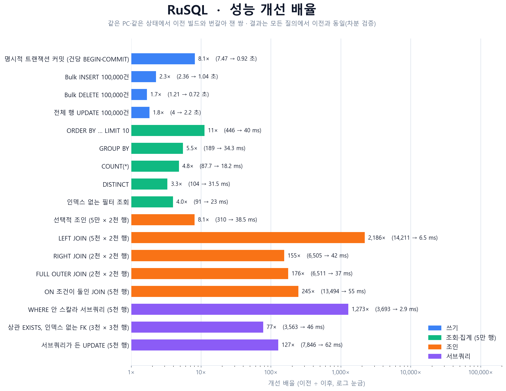

# RuSQL — 2학기 성과 요약 (발표용)

> 상세한 날짜별 기록은 `DATE.md`, 기능 목록은 `FUNCTIONS.md`, 설계 계획과 알려진 한계는 `PLAN.md`에 있습니다.
> 이 문서는 그 가운데 발표에서 말할 것만 한 장으로 줄인 것입니다. 수치의 측정 조건은 `DATE.md` 10월 2일·3일 항목에 있습니다.

## 한눈에

| | |
|---|---|
| 무엇 | MySQL 호환 프로토콜을 쓰는 **자체 RDBMS 엔진**(C++20) + 데스크톱 클라이언트(Tauri/React) + Claude 연동(MCP) |
| 1학기 → 2학기 | Rust 프로토타입 → **C++ 전면 재작성**, "기능 추가"에서 **정합성·동시성·성능을 실제로 파고드는 심화**로 |
| 규모 | 테스트 **574 케이스 / 1,333,363 assertions** (2학기 초 218 케이스 / 3,080 assertions) |
| 엔진 구성 | 파서 → 비용 기반 플래너 → 실행기, MVCC·행 단위 락·데드락 감지, redo 로그 기반 내구성, B+Tree·해시·복합 인덱스 |

## 2학기에 만든 것 (엔진)

- **진짜 MVCC**: 버전 체인(`_xmin`/`_xmax`), 격리 수준 4단계가 실제로 다르게 동작, Gap Lock·SSI.
- **행 단위 동시 쓰기 + 블로킹 락 + 데드락 감지**.
- **내구성**: autocommit도 응답 전에 fsync(redo 로그), 크래시 후 재생. 테이블 파일은 체크포인트에서만 다시 씀.
- **쿼리 엔진**: 조인 알고리즘 5종(중첩 루프·해시·정렬 병합·인덱스 NL·역방향 인덱스 NL)과 비용 기반 선택, CTE(재귀 포함), 윈도우 함수, 서브쿼리, 파티셔닝, 저장 프로시저·트리거.

## 성능: 같은 결과를 더 빨리



- 방침: **MySQL을 따라잡는 것이 아니라 RuSQL 자신의 병목을 측정해서 고친다.** 매번 "측정 → 원인 → 수정 → 이전 빌드와 번갈아 재측정" 순서.
- 가장 큰 개선은 **이차 시간 절벽 제거**(LEFT/RIGHT/FULL JOIN, 상관 서브쿼리, WHERE 안 서브쿼리): 행이 늘면 시간이 제곱으로 늘던 문장이 선형이 됨.
- 구조적 원인은 대부분 같았음 — 행 하나가 해시 맵이라 **복사·재파싱이 비용을 지배**. 해법도 같았음: 포인터로 읽기, 필요할 때만 복사, 해시로 후보 좁히기.
- 바뀌지 않은 것: 단건 쓰기 속도는 디스크 fsync가 바닥(MySQL과 같은 내구성 조건에서 같은 값).

## 어떻게 "맞다"고 확신하는가

성능 작업의 위험은 결과가 틀어지는 것이므로 검증에 가장 많이 투자했습니다.

1. **빌드 간 차분 검증** (`code/test/diff/diff_builds.py`): 이전 빌드와 새 빌드에 같은 무작위 SQL(합계 4만 개 이상)을 보내 출력을 글자 단위로 비교.
2. **쌍둥이 질의 대조**: 같은 질의를 "최적화 경로를 못 타게 바꾼" 형태(`… OR 1 = 0`)로 다시 써서 느린 경로와 답이 같은지 확인.
3. **일부러 버그를 심어 보기(mutation)**: 테스트가 정말 잡아내는지 라운드마다 수십 종(최근 타입 인식 비교는 97종)을 심어 확인. 이 과정에서 "0 차이로 통과"가 실제로는 새 경로를 한 번도 안 탄 경우였던 구현 결함을 발견.
4. **크래시 퍼저**: 서버를 `kill -9`로 죽이고 복구한 뒤 확인 가능한 상태와 비교(동시 4개 클라이언트 포함), 복구 뒤 인덱스 질의까지 검사.
5. **무작위 차분 퍼저**: 모든 접근 경로(PK·보조·해시·복합 인덱스)의 답을 같은 질의의 스캔 결과와 대조.
6. Debug·Release, 그리고 모든 DML을 인덱스 경로로 강제한 설정까지 전체 스위트 통과.

## 이 과정에서 찾아 고친 중요한 기존 버그

| 버그 | 영향 |
|---|---|
| 복구 때 **완전히 같은 행이 하나로 합쳐짐** (PK 없는 테이블, 한 트랜잭션) | 크래시 후 **데이터 유실** |
| 세 번째 이후 조인이 앞선 테이블의 열을 이름만으로 읽음 | 208행이어야 할 결과가 **16행** |
| 인덱스가 `.idx` 파일 기준이라 체크포인트 뒤 재시작하면 **빈 인덱스** | 인덱스로 찾으면 0행(스캔은 찾음) |
| 비유일 복합 인덱스가 같은 값의 행 중 **마지막 하나만 기억** | 인덱스 유무에 따라 답이 달라짐 |
| 해시·정렬 병합 조인이 **NULL을 NULL과 매칭** | 조인 결과에 없어야 할 행 |
| PK가 첫 열이 아닌 테이블에서 `WHERE id = N`이 항상 0행 | 오답 |
| `ORDER BY 테이블.열`이 정렬을 안 함 | 조인에서는 알고리즘이 내는 순서 그대로 |
| `SELECT DISTINCT 테이블.열`이 한 행만 돌려줌 | 값이 여러 개여도 1행 |
| 집계 인자의 `테이블.열`에서 테이블이 버려짐(`COUNT(b.id)`) | 두 테이블에 같은 `id`가 있으면 왼쪽 테이블 열을 셈 — `LEFT JOIN`에서 주문 없는 고객도 1로 셈 |
| `HAVING COUNT(열)`이 NULL을 세지 않고 행 수를 돌려줌 | 주문 없는 고객을 `HAVING COUNT(o.id) = 0`으로 못 찾음 |
| select 목록의 식·함수 속 집계(`MAX(v) - MIN(v)`, `ROUND(AVG(v), 2)`, `COALESCE(SUM(v), 0)`)가 0이고 `GROUP BY`가 없으면 테이블 행마다 한 행 | 흔한 집계 식이 전부 오답 |
| NULL이 든 산술·비교·스칼라 함수가 NULL이 아니라 `NULL1`·0·4 같은 값을 돌려주고 `x / 0`이 0, `UPDATE`가 그 값을 저장 | `SET v = v + 1`이 NULL 행에 글자 `NULL1`을 저장 |
| `ROUND(a.x * a.y, 2)`처럼 한정된 열의 식을 함수 인자로 쓰면 곱셈 없이 마지막 열만 읽음 | 조인 질의의 계산 열이 조용히 틀림 |
| 함수 인자 속 별칭이 첫 번째만 테이블로 풀림(`ROUND(y.g * y.g, 2)` → `u.g*y.g`) | 별칭을 쓴 조인에서 같은 이름의 열 계산이 틀림 |
| **빈 문자열 `''`이 NULL로 저장됨**(`IS NULL`·`COALESCE`·UNIQUE도 `''`를 NULL로 취급) | `WHERE s = ''`가 아무 행도 못 찾음 |
| **타입 검사가 없음** — `INT`에 `'abc'`, `DATE`에 `'2024-02-30'`, `VARCHAR(3)`에 `'toolong'`, `DECIMAL(5,2)`에 `123456.789` | 잘못된 값이 그대로 저장되고 이후 계산이 틀어짐 |
| **`UPDATE`가 NOT NULL·자식 쪽 외래 키를 검사하지 않음**, ON UPDATE RESTRICT는 행을 바꾼 뒤 검사 | 제약을 어기는 데이터가 들어가거나, 오류가 났는데 행은 이미 바뀜 |
| **실패한 `REPLACE INTO`가 옛 행을 이미 지움** | NOT NULL 위반 같은 오류가 나면 **행만 사라지는 데이터 유실** |
| `ON DUPLICATE KEY UPDATE`·다중 테이블 UPDATE가 행을 제자리에서 바꿈(되돌리기 기록·제약 검사 없음) | ROLLBACK이 되돌리지 못하고 NOT NULL·UNIQUE·외래 키를 어길 수 있음 |
| NULL과의 `NOT`·`IN`·`NOT IN`·비교가 UNKNOWN이 아니라 TRUE, 서브쿼리가 NULL이면 글자 "NULL"을 0으로 비교, NULL이 정렬에서 글자 | `x NOT IN (1, NULL)`이 행을 골라 냄, `ORDER BY`의 NULL 위치가 값 모양에 따라 흔들림 |
| AUTO_INCREMENT가 직접 넣은 번호를 모르고, 삭제된 부모 행도 외래 키 부모로 인정 | 번호 충돌, 지워진 부모를 가리키는 자식 |
| **같은 테이블을 두 번 쓰는 조인**(`emp e JOIN emp m ON e.mgr = m.id`)이 두 사용을 한 테이블로 봄 | `ann \| ann …`, `ON a.id < b.id`가 0행, LEFT JOIN이 전부 NULL — 직원–상사 같은 흔한 질의가 오답 |
| **`SELECT *`가 조인에서 같은 이름의 열을 왼쪽 값으로** 채움, `*, 열`이 열을 조용히 버림, `DISTINCT *`가 중복을 못 합침 | b.id가 2인데 1이 나옴 |
| `USING`이 조인 종류를 무시(LEFT JOIN … USING이 INNER), NATURAL이 NULL끼리 매칭 | 짝 없는 행이 사라짐 |
| RIGHT/FULL OUTER JOIN이 짝 없는 행의 왼쪽을 첫 왼쪽 행의 키만 보고 채움 | 왼쪽에 행이 없거나 앞선 조인이 있으면 오른쪽 값이 새어 들어감 |
| 한 테이블 UPDATE의 `SET t.v = 1`과 없는 열 `SET zz = 5`가 "1 row(s) updated"인데 행에 보이지 않는 키를 만듦 | 값은 안 바뀌고 이후 읽기가 그 키를 읽음 |
| **존재하지 않는 열 이름이 어디서나 조용히 받아들여짐**(`SELECT nosuch`는 빈 열, `WHERE nosuch > 1`은 0행) | 오타가 "데이터 없음"으로 보임 — 이제 MySQL처럼 `Unknown column` 오류 |
| **프로시저 매개변수·`@변수`가 문장 안에서 값이 아니었음**(`UPDATE … WHERE id = p_id`가 "0 row(s)", `WHERE v > @x`가 0행) | 저장 프로시저가 DML에는 쓸 수 없었음 |
| **트리거가 문장당 한 번, 행 값(`NEW`/`OLD`) 없이** 돌고 본체의 오류를 무시 | 여러 행 INSERT도 한 번, 0행이어도 한 번, 감사 로그를 못 씀 |
| 설정하지 않은 `@변수`를 읽으면 NULL이 아니라 변수 이름 글자 | `SELECT @r`이 `@r` |
| **값이 없는 집계가 NULL이 아니라 0 / 0.0000 / 빈 문자열 / `[]`**(`SUM`·`AVG`·`STDDEV`·`GROUP_CONCAT`·`JSON_AGG`·윈도) | `v IN (SELECT SUM(v) … 빈 집합)`이 `v = 0`인 행을 맞힘, `HAVING AVG(v) < 60`이 값 없는 그룹을 통과 |
| 텍스트 산술: `+`가 글자를 이어 붙이고(`'x' + 1` → `x1`) `- * /`가 숫자 아닌 글자를 통째로 0으로 읽음 | `'12abc' * 2`가 0(MySQL 24), `s - 1`이 0 |
| 소수 합계의 부동소수 오차와 2^53 넘는 정수의 조용한 오차 | `SUM(0.10 × 10)`이 1이 아니라 `HAVING SUM(x) = 1`이 거짓, `n + 1`이 `…992` |
| `AVG`가 select 목록에서는 4자리, `HAVING`/식에서는 전체 정밀도 | 같은 `HAVING AVG(v) = 1.6667`이 select 목록에 `AVG(v)`가 있느냐에 따라 다른 결과 |
| FROM 없는 `SELECT CASE …` / `(SELECT …)` / `COUNT(*)`가 빈 값 | `SELECT (SELECT COUNT(*) FROM t)`가 `''` |
| **`SUM(CASE WHEN …)`·`COUNT(CASE WHEN …)`가 `Unknown column '__case__'`**(앞 항목의 회귀, 푸시된 뒤 발견) | 조건부 집계가 전부 오류 |
| **VARCHAR 열의 비교·정렬·인덱스가 열 타입이 아니라 값의 모양으로 정해짐** — B+Tree 비교기가 이행적이지 않아 숫자처럼 보이는 키와 영숫자 키가 섞인 VARCHAR 키 조회가 누락(344개 중 58개), `ORDER BY code`가 사전식이 아니고 `code = '7'`이 `'007'`도 맞힘 | 키로 찾으면 0행, 정렬·`MIN`/`MAX`·조인이 MySQL과 다름 |
| 우변의 따옴표가 사라져 `WHERE name = 'city'`가 `city` **열**과 비교됨(IN·BETWEEN·변수·엔진이 만드는 조건도) | 값이 열 이름과 같으면 엉뚱한 행이 선택됨 |
| 2^53을 넘는 정수가 비교·정렬·`MIN`/`MAX`·조인 해시에서 같은 수로 취급됨 | `9007199254740993`과 `…992`가 같은 키 |
| **한 select 목록의 조건부 집계 둘이 같은 결과 열 `SUM(CASE)`라 마지막 값이 둘 다로 표시됨**(`SUM(CASE WHEN a > 1 …)`=3이 `SUM(CASE WHEN a > 4 …)`=1로 보임) | 집계표(피벗) 질의가 조용히 틀림 |
| **식의 텍스트가 괄호를 잃음** — 함수 인자 `ROUND((a + b) * 2, 1)`이 `a + (b * 2)`로 계산됨 | 괄호를 쓴 계산이 조용히 틀림 |
| 집계의 인자가 열 이름뿐 — `SUM(price * qty)`·`AVG(a + b)`가 파싱 오류 | 매출 합계 같은 흔한 질의가 실패 |
| **여러 행·여러 열을 돌려주는 스칼라 서브쿼리가 오류 없이 첫 값** — `UPDATE t SET v = 0 WHERE v = (SELECT a FROM u)`가 첫 행의 값이 가리키는 행을 조용히 바꿈 | MySQL은 오류 1242/1241 |
| **서브쿼리 안의 오류가 "행 없음"** — 없는 테이블·안쪽 서브쿼리의 두 행이 `IN`/`EXISTS`는 FALSE, 스칼라는 NULL, `UPDATE`/`DELETE`는 "0 row(s)" | 오류가 어디에도 보이지 않음 |
| **HAVING의 서브쿼리 비교가 늘 FALSE**, **GROUP BY 없는 집계의 HAVING**이 집계 전의 행마다 평가됨(`SELECT SUM(v) FROM t HAVING SUM(v) > 5`가 NULL) | 조건이 늘 거짓이거나 합계가 NULL |
| **`SUM(CASE WHEN …) * 100.0 / COUNT(*)`가 조용히 NULL**(안의 이름이 `AGG(__case__)`), `HAVING SUM(CASE …)`·`SUM(CASE WHEN c THEN a * b END)`는 파싱 오류, `AVG`/`MIN`/`MAX(CASE …)`는 `Unknown column '__case__'` | 비율·점유율 같은 분석 질의가 NULL이거나 실패 |
| **`COUNT(CASE WHEN c THEN 1 ELSE 0 END)`가 모든 행이 아니라 조건이 참인 행만 셈**(MySQL은 NULL이 아닌 값 = 5, 엔진 3), `COUNT(a >= 30)`도 | 조건부 집계의 개수가 틀림 |
| **`CASE … THEN 'n'`·`IF(c, 'n', …)`의 문자열이 같은 이름의 열이 있으면 그 열의 값**(따옴표를 잃은 문자열을 열 이름으로 읽음) | 라벨이 열 값으로 바뀜 |
| **`v BETWEEN w AND 20`이 열 `w`를 문자열 "w"로 비교**, 식 경계(`BETWEEN a AND a + 10`)는 파싱 오류 | 열을 경계로 쓴 범위 조건이 조용히 틀림 |
| **`ROUND(x) * 100`·`COALESCE(a, 0) + COALESCE(b, 0)`·`CAST(v AS SIGNED) + 1`처럼 함수가 식의 처음에 오면 파싱 오류**, 조건이 값이 아니고(`SELECT v BETWEEN 5 AND 20`) 값이 조건이 아님(`WHERE flag`, `WHERE TRUE`), `INSERT … VALUES (1 + 2, UPPER('x'))`·`CURRENT_DATE` 파싱 오류 | 흔한 식이 실패 |
| `NULLIF(5, 5.00)`이 NULL이 아님(글자 비교), **5자리 이상 소수의 합이 4자리로 반올림**(`SUM(price * rate)`), 리터럴 `-0`이 `-0`으로 출력 | 작은 수치 오차·표시 오류 |
| **`CURRENT_DATE`·`SYSDATE()`가 쿼리 캐시에 남음** | 자정이 지나도 어제 날짜 |
| **UPDATE·DELETE의 기본키 단축 경로가 조건을 다시 보지 않음**: `DELETE FROM t WHERE a = b`가 `a = 'b'`인 행을 지움, 텍스트 키의 `WHERE code = 7`이 `'7'`만 처리, 정수 키의 `BETWEEN 5.0 AND 9`가 5번 행을 빠뜨림 | **엉뚱한 행 삭제**·일부 행만 처리 |

성능·정합성 작업의 커밋들에서 찾은 기존 버그는 모두 78건입니다(전체 목록은 `DATE.md`).

## 한계와 앞으로

- 이번 학기 성능 작업은 **의도적으로 여기서 동결**했습니다. 남은 것은 상수 배수 수준(100,000행에서 `ANALYZE`·`INSERT … SELECT`·`UNION ALL`이 1.5~1.7초)이며 `PLAN.md`에 후보로 기록했습니다.
- 쓰는 문장 안의 상관 서브쿼리, `NATURAL`/`USING` 조인은 아직 중첩 루프입니다.
- 설계상 범위 밖: XA 분산 트랜잭션, 페이지 단위 버퍼 풀, WAL 복제.
- 알려진 한계(`PLAN.md`): `= ANY/ALL (서브쿼리)`·행 생성자 비교가 없는 것, 모호한 열 이름이 오류 없이 첫 테이블 값을 읽는 것, AFTER 트리거 실패가 쓴 행을 되돌리지 않는 것, 식 문법의 빈틈(`ORDER BY`의 별칭·번호·식 — 별칭으로 정렬하면 조용히 정렬이 안 됨, 서브쿼리의 바깥 참조가 비교의 왼쪽에 있는 경우, 식 안의 서브쿼리), 타입을 모르는 식(`COALESCE`·`IF` 결과)·`IN (서브쿼리)`·`UNION`의 `ORDER BY` 같은 몇몇 비교는 예전 규칙, 대소문자 구분 비교(MySQL 기본은 구분 안 함).
- AI는 사설 모델 대신 **Claude + MCP**로 일원화했습니다(`AI.md`).

## 직접 확인해 보기

```text
# 전체 테스트 (Release)
cmake --build code/build --config Release --target engine_tests
code/build/backend/tests/Release/engine_tests

# 성능 측정 (서버를 7878 포트로 띄운 뒤)
python code/test/perf/bench.py          # 쓰기·트랜잭션·인덱스 조회
python code/test/perf/bench_query.py    # 스캔·집계·조인
python code/test/perf/graph.py          # benchmark_result.png

# 이전 빌드와 결과 비교
python code/test/diff/diff_builds.py <이전 engine_server.exe> <새 engine_server.exe> --queries 1500 --seed 1

# 크래시 복구 검증
python code/test/crash/fuzz_crash.py 60
```
